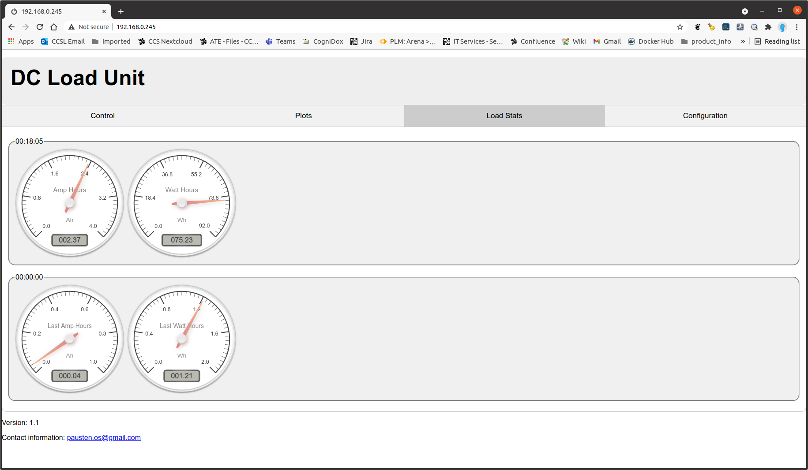

# DC Load Unit
I started this project with some basic requirements.

- Voltages up to 100 V
- Provide loads of up to 200W
- WiFi interface
- Web based interface providing stats and plotting capabilities

## Design
I used an ESP32 processor in the design as the main processor using  [Mongoose OS](https://mongoose-os.com/) After some investigations and prototyping I eventually settled on the schematic shown below.

From the schematic a PCB was created as shown below

Tests on completion of the load unit showed it was capable of providing a load of 280W.

- Images of the completed unit.

The green LED on the unit indicates that it is connected to the WiFi.

## Web interface
The web interface uses a tabbed pane structure as shown below.

### Main interface

- Plots
The plots tab displays the amps, volts, Watts and Temperature against time as show below.

- Load stats
The load stats page records the load in amp hours and watt hours. The top two dials show the current accumulating values and the bottom two dials show the previous values. The previous values are useful for showing the total capacity of a battery tested.

- Configuration
The configuration page details the settings for the unit as detailed below.

- Device name:

 The name that appears at the top of the web page and also in the [Yview](https://github.com/pjaos/yview) as the device provides integration into the YView network.

- Group name:

  The YView group name. See [Yview](https://github.com/pjaos/yview) for more details.

- Enable syslog

  If enabled then syslog data is sent to the source of the AYT messages (YView gateway).

- Max Plot values

  Defines the max number of points on the displayed plots.

- Max power

  This defines the maximum power the load will handle. This is limited to 280 Watts. When testing it can be useful to set this value to the max load that the device under test will deliver in order not to inadvertently overload the device under test.

- Load Shutdown Voltage

  When testing battery packs the voltage will drop as the battery looses charge. This setting allows the user to ensure the battery voltage does not drop to far possibly damaging the battery.
